# 宠物问诊流程图

> 基于 `pet-consult-v7.3` 代码生成的完整问诊处理流程

---

## 完整流程图

```mermaid
flowchart TD
    %% ===== 用户入口 =====
    UserStart([用户发起问诊请求]) --> API{API 路由层<br/>POST /api/v1/consult}

    %% ===== API 层 =====
    API --> Parse["解析请求参数<br/>text / images / pet_info / pet_ref<br/>idempotency_key"]
    Parse --> RateLimit{"速率限制<br/>RateLimiter"}
    RateLimit -->|超限| RateLimitErr["返回 429 Too Many Requests"]
    RateLimit -->|允许| Validate{"校验输入<br/>- text 和 images 至少一项<br/>- 最多 3 张图片<br/>- 单张 ≤ 5MB"}

    Validate -->|校验失败| ValErr["返回 422 参数错误"]
    Validate -->|通过| MQCheck{"队列模式<br/>consult_mq_enabled?"}

    %% ===== 队列模式分支 =====
    MQCheck -->|是| QueuePath["队列模式执行"]
    MQCheck -->|否| DirectPath["同步直连模式执行"]

    %% ===== 队列模式 =====
    QueuePath --> EmergencyPrecheckQ["急症预判（纯规则）"]
    EmergencyPrecheckQ -->|急症 P0| QueueRegEmergency["登记 pre_answered 任务<br/>→ 同步返回固定急症模板"]
    EmergencyPrecheckQ -->|非急症| FastAnswerCheckQ{"RAG 直答预判<br/>is_fast_answerable?"}
    
    FastAnswerCheckQ -->|命中直答| FastGate{"并发闸门<br/>fast_gate.acquire?"}
    FastGate -->|有额度| FastPathQ["同步执行直答<br/>→ 登记 fast_path 任务<br/>→ 返回结果"]
    FastGate -->|满额溢出| FastOverflowQ["登记 fast_path 任务<br/>→ 队列等待结果"]
    
    FastAnswerCheckQ -->|普通症状问诊| QueueRegister["登记普通任务<br/>→ 队列等待结果"]
    QueueRegister --> WaitResult["轮询等待结果<br/>（SSE 或同步等待）"]
    FastOverflowQ --> WaitResult
    WaitResult -->|超时| QueueTimeout["返回 TASK_TIMEOUT"]
    WaitResult -->|完成| ReturnResult["返回 ConsultResponse"]

    %% ===== 同步直连模式 =====
    DirectPath --> AgentRun["ConsultAgent.run() / .run_stream()"]

    %% ===== Agent 主流程 _run_impl =====
    AgentRun --> InitState["初始化 ConsultState<br/>- 生成 request_id<br/>- 推断物种<br/>- 创建 deadline 预算"]

    InitState --> RagEmergencyShadow["RAG 急症影子匹配<br/>V14EmergencyShadowMatcher<br/>（不影响主流程）"]
    
    RagEmergencyShadow --> IdempotencyCheck{"幂等性检查<br/>idempotency_key?"}
    IdempotencyCheck -->|命中缓存| ReturnCached["返回缓存的之前结果"]
    IdempotencyCheck -->|未命中| AcquireLock{"获取会话锁<br/>conversation_lock"}

    AcquireLock -->|冲突| LockConflict["返回 CONVERSATION_CONFLICT"]
    AcquireLock -->|成功| TextEmergencyPrecheck["步骤 1: 文字急症预判<br/>EmergencyRuleEngine.precheck_text<br/>（纯规则，不调外部服务）"]

    TextEmergencyPrecheck -->|急症 EMERGENCY| FixedUrgent["直接返回固定急症模板<br/>_fixed_urgent_response"]
    TextEmergencyPrecheck -->|非急症| LoadContext["步骤 2: 加载会话上下文<br/>- 历史对话 turns<br/>- 历史摘要 summary<br/>（Redis 不可用则降级）"]

    LoadContext --> InputModeration["步骤 3: 输入内容安全审核<br/>input_moderator.check_input<br/>（场景化审核，医疗求助不拒）"]

    InputModeration -->|审核不通过| Refuse["返回 REFUSE<br/>拒绝请求"]
    InputModeration -->|审核通过| OutOfScopeCheck{"显式非宠物问诊?<br/>_is_out_of_scope_query"}
    
    OutOfScopeCheck -->|是| OutOfScopeResp["返回固定非问诊范围模板"]
    OutOfScopeCheck -->|否| ImageAnalysis{"步骤 4: 图片分析<br/>有图片上传?"}

    ImageAnalysis -->|有图片| VisionAnalysis["VisionService.analyze<br/>- 调用 VisionGateway<br/>- 视觉分析 + 提取 red_flags<br/>- 预算 15s"]
    ImageAnalysis -->|无图片| SkipVision["跳过图片分析"]

    VisionAnalysis -->|成功| VisionResult["记录 vision_findings"]
    VisionAnalysis -->|超时/不可用/解析失败| VisionDegraded["降级处理<br/>- 记录 degraded_services<br/>- 清空 findings<br/>- 继续文字问诊"]

    VisionResult --> VisionOnlyCheck{"只有图片<br/>且图片分析失败?"}
    VisionDegraded --> VisionOnlyCheck

    VisionOnlyCheck -->|是| ReturnReview["返回 REVIEW<br/>原因: image_unavailable"]
    VisionOnlyCheck -->|否| SpeciesConflictCheck{"物种冲突检测<br/>_detect_species_conflict"}

    SpeciesConflictCheck -->|冲突| ConflictHandle["- 以文字为准<br/>- 加入追问确认<br/>- 清空 findings"]
    SpeciesConflictCheck -->|无冲突| NoPetCheck{"图片无宠物?<br/>_detect_no_pet"}

    NoPetCheck -->|无宠物+无文字| NoPetHandle["追问：请重新拍摄宠物照片"]
    NoPetCheck -->|无宠物+有文字| NoPetDegrade["忽略图片，按文字继续"]
    NoPetCheck -->|有宠物| RagRetrieval["步骤 5: RAG 知识检索<br/>ShadowRetriever.search<br/>- 检索知识卡片<br/>- 构建 grounded 证据<br/>- 提取追问问题"]

    RagRetrieval --> CompletenessCheck["步骤 5.1: 信息完整性评估<br/>CompletenessChecker.evaluate<br/>- 是否需要更多信息<br/>- 生成追问列表"]

    CompletenessCheck --> RiskAssessment["步骤 6: 综合风险分级<br/>- EmergencyRuleEngine.evaluate<br/>- RiskEngine.evaluate<br/>- 合并文字预判 + 图片红旗"]

    RiskAssessment -->|风险等级 EMERGENCY| FixedUrgent2["返回固定急症模板<br/>_fixed_urgent_response"]
    RiskAssessment -->|LOW/MEDIUM| FastAnswerCheck{"步骤 6.5: 直答通道<br/>RAG 快速问答?"}

    FastAnswerCheck -->|是| FastAnswer["返回 RAG 卡片直答<br/>不调生成模型"]
    FastAnswerCheck -->|否| PetAmbiguousCheck{"多宠歧义?<br/>pet_ambiguous"}

    PetAmbiguousCheck -->|是| PetAmbiguousResp["返回固定追问模板<br/>'请问您问的是哪只宠物?'"]
    PetAmbiguousCheck -->|否| SelectMode{"步骤 7: 选择生成模式"}

    SelectMode -->|HIGH 风险| UrgentGeneration["急症指导模式<br/>generate_urgent_guidance"]
    SelectMode -->|信息不足+硬性缺失| ProvisionalGeneration["信息不足模式<br/>generate_provisional<br/>初步回答 + 追问 + 补拍建议"]
    SelectMode -->|正常| NormalGeneration["正常模式<br/>generate<br/>可能性分析 + 护理 + 就医阈值"]

    UrgentGeneration --> MedicalReview
    ProvisionalGeneration --> MedicalReview
    NormalGeneration --> MedicalReview

    MedicalReview["步骤 8: 医疗安全审核<br/>MedicalSafetyService.review<br/>- 诊断规则检查<br/>- 用药规则检查<br/>- 急症规则检查"]

    MedicalReview -->|通过| OutputModeration
    MedicalReview -->|不通过| LocalRepair["本地确定性修复<br/>repair_locally<br/>（修复违规字段）"]

    LocalRepair --> RepairReview{"再次审核已通过?"}
    RepairReview -->|通过| OutputModeration
    RepairReview -->|不通过| RewriteCheck{"有预算重写?<br/>rewrite_once"}

    RewriteCheck -->|是| RewriteOnce["安全重写一次<br/>携带违规清单<br/>仅修正违规"]
    RewriteOnce --> RewriteReview{"重写后审核通过?"}
    RewriteReview -->|通过| OutputModeration
    RewriteReview -->|仍不通过| FixedSafe["降级为固定安全模板<br/>build_fixed_safe_answer"]

    RewriteCheck -->|否（预算不足）| FixedSafe

    FixedSafe --> OutputModeration

    OutputModeration["步骤 9: 输出内容安全审核<br/>output_moderator.check_output"]

    OutputModeration -->|拦截| ReturnReview2["返回 REVIEW<br/>人工审核"]
    OutputModeration -->|通过| AssembleResponse["步骤 10: 组装响应<br/>- 清理面向用户语言<br/>- 保存对话历史<br/>- 组装 ConsultResponse"]

    AssembleResponse --> ArchiveDialogue["存档对话<br/>DialogueArchive<br/>（含耗时指标）"]

    ArchiveDialogue --> ReturnSuccess["返回 ConsultResponse<br/>status: success"]

    %% ===== 异常处理 =====
    AgentRun -->|ConversationConflictError| ErrConflict["返回 CONVERSATION_CONFLICT"]
    AgentRun -->|RequestDeadlineExceeded| ErrDeadline{"急症?"}
    ErrDeadline -->|是| FixedUrgentDeadline["固定急症模板"]
    ErrDeadline -->|否| ErrTimeout["返回 REQUEST_DEADLINE_EXCEEDED"]
    AgentRun -->|ExternalServiceTimeout| ErrExternal{"急症?"}
    ErrExternal -->|是| FixedUrgentExternal["固定急症模板"]
    ErrExternal -->|否| ErrExternalTimeout["返回外部服务超时"]
    AgentRun -->|其他异常| ErrOther{"急症?"}
    ErrOther -->|是| FixedUrgentOther["固定急症模板"]
    ErrOther -->|否| ErrInternal["返回 INTERNAL_ERROR"]

    %% ===== 样式 =====
    classDef api fill:#e1f5fe,stroke:#01579b,stroke-width:1px
    classDef queue fill:#fff3e0,stroke:#e65100,stroke-width:1px
    classDef agent fill:#e8f5e9,stroke:#1b5e20,stroke-width:1px
    classDef safety fill:#fce4ec,stroke:#b71c1c,stroke-width:1px
    classDef decision fill:#f3e5f5,stroke:#4a148c,stroke-width:1px
    classDef terminal fill:#ffebee,stroke:#c62828,stroke-width:2px
    classDef success fill:#e8f5e9,stroke:#2e7d32,stroke-width:2px

    class API,Parse,RateLimit,Validate api
    class QueuePath,EmergencyPrecheckQ,FastAnswerCheckQ,FastGate,FastPathQ,FastOverflowQ,QueueRegister,WaitResult,QueueTimeout queue
    class AgentRun,InitState,RagEmergencyShadow,IdempotencyCheck,AcquireLock,TextEmergencyPrecheck,LoadContext,OutOfScopeCheck,ImageAnalysis,VisionAnalysis,VisionResult,VisionDegraded,RagRetrieval,CompletenessCheck,RiskAssessment,FastAnswerCheck,SelectMode,UrgentGeneration,ProvisionalGeneration,NormalGeneration,AssembleResponse,ArchiveDialogue,RewriteOnce agent
    class InputModeration,Refuse,MedicalReview,LocalRepair,RepairReview,RewriteCheck,RewriteReview,FixedSafe,OutputModeration,ReturnReview2 safety
    class FixedUrgent,FixedUrgent2,FixedUrgentDeadline,FixedUrgentExternal,FixedUrgentOther decision
    class ReturnCached,LockConflict,ReturnSuccess,ReturnReview,ErrConflict,ErrTimeout,ErrInternal,ErrExternalTimeout,RateLimitErr,ValErr,OutOfScopeResp,PetAmbiguousResp,QueueTimeout,FastAnswer,ReturnResult terminal
    class ReturnResult,ReturnSuccess success
```



---

## 流程图说明

### 1. 整体架构（三层）

| 层级 | 文件 | 职责 |
|------|------|------|
| **API 路由层** | [consult.py](../app/api/consult.py) | 协议转换：表单 → ConsultCommand；速率限制；队列调度 |
| **Agent 编排层** | [consult_agent.py](../app/agent/consult_agent.py) | 固定状态机编排，协调各服务执行 |
| **服务层** | 多个 service 文件 | 具体业务逻辑（问诊生成、审核、检索等） |

### 2. 核心状态机

定义在 [state_machine.py](../app/agent/state_machine.py) 中：

```
RECEIVED → TEXT_EMERGENCY_PRECHECK → LOAD_CONTEXT → INPUT_MODERATION →
IMAGE_ANALYSIS → COMPLETENESS_AND_RISK → (NORMAL|PROVISIONAL|URGENT)_GENERATION
→ MEDICAL_REVIEW → (REWRITE_ONCE → MEDICAL_REVIEW) → OUTPUT_MODERATION → DONE
```

### 3. 各步骤对应源码

| 步骤 | 状态 | 源码位置 |
|------|------|----------|
| 初始化状态 | `RECEIVED` | [consult_agent.py:InitState](../app/agent/consult_agent.py#L171-L175) |
| 文字急症预判 | `TEXT_EMERGENCY_PRECHECK` | [consult_agent.py:TextEmergencyPrecheck](../app/agent/consult_agent.py#L198-L210) |
| 加载会话上下文 | `LOAD_CONTEXT` | [consult_agent.py:LoadContext](../app/agent/consult_agent.py#L330-L340) |
| 输入安全审核 | `INPUT_MODERATION` | [consult_agent.py:InputModeration](../app/agent/consult_agent.py#L347-L365) |
| 图片视觉分析 | `IMAGE_ANALYSIS` | [consult_agent.py:VisionAnalysis](../app/agent/consult_agent.py#L380-L430) |
| RAG 知识检索 | *(状态内)* | [consult_agent.py:RagRetrieval](../app/agent/consult_agent.py#L456-L490) |
| 信息完整性评估 | `COMPLETENESS_AND_RISK` | [consult_agent.py:CompletenessCheck](../app/agent/consult_agent.py#L493-L530) |
| 综合风险评估 | `COMPLETENESS_AND_RISK` | [consult_agent.py:RiskAssessment](../app/agent/consult_agent.py#L533-L550) |
| 生成问诊建议 | `NORMAL/PROVISIONAL/URGENT_GENERATION` | [consult_agent.py:SelectMode](../app/agent/consult_agent.py#L560-L620) |
| 医疗安全审核 | `MEDICAL_REVIEW` | [consult_agent.py:MedicalReview](../app/agent/consult_agent.py#L640-L700) |
| 安全重写 | `REWRITE_ONCE` | [consult_agent.py:RewriteOnce](../app/agent/consult_agent.py#L660-L690) |
| 输出安全审核 | `OUTPUT_MODERATION` | [consult_agent.py:OutputModeration](../app/agent/consult_agent.py#L710-L740) |
| 组装响应 | `DONE` | [consult_agent.py:AssembleResponse](../app/agent/consult_agent.py#L745-L760) |

### 4. 关键设计要点

- **急症优先**：文字急症预判放在一切模型依赖之前（纯规则，不调外部服务），命中后任何失败都走固定急症模板
- **绝对 Deadline**：各阶段从统一预算领取，重试不会重新获得完整预算
- **Vision 降级**：图片分析超时/OOM/JSON 失败 → 记录 degraded，文字可继续
- **医疗安全检查**：不通过先本地修复 → 修复不成再重写一次 → 仍失败 → 固定安全模板
- **回答优先**：高风险不短路（切 urgent_guidance），信息不足不终止（provisional）
- **队列模式**：支持消息队列异步处理，避免高并发时服务过载
- **幂等性**：通过 Idempotency-Key 防止重复提交
- **RAG 直答**：简单问答直接走知识卡片直答，不调生成模型，响应 < 100ms

### 5. 颜色说明

| 颜色 | 含义 | 对应层 |
|------|------|--------|
| 🔵 蓝色 | API 路由层 | 请求解析、速率限制、校验 |
| 🟠 橙色 | 队列调度层 | 消息队列、任务排队、异步等待 |
| 🟢 绿色 | Agent 编排层 | 状态机流转、核心业务编排 |
| 🔴 红色 | 安全审核层 | 输入/输出审核、医疗安全 |
| 🟣 紫色 | 决策分支 | 条件判断、分支选择 |
| ⚪ 白色（粗边框） | 终止节点 | 错误/拒绝/超时等终止状态 |
| 🟢 绿色（粗边框） | 成功终端 | 成功返回结果 |